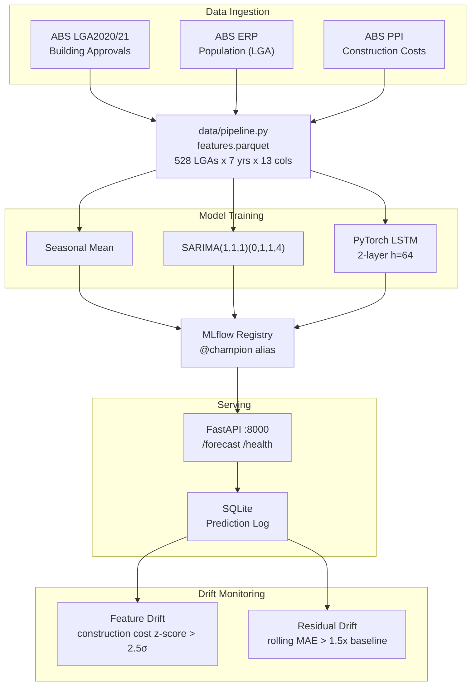
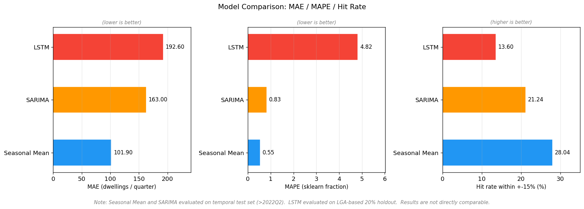
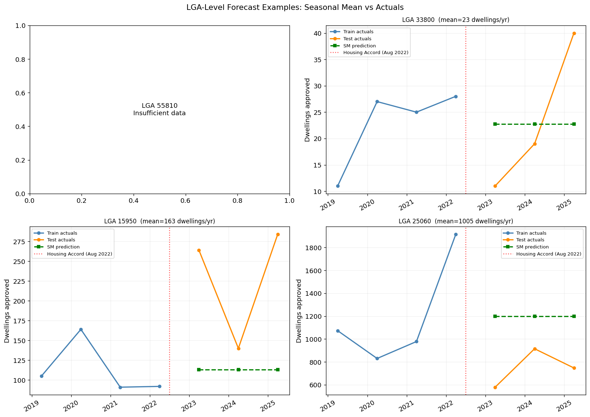
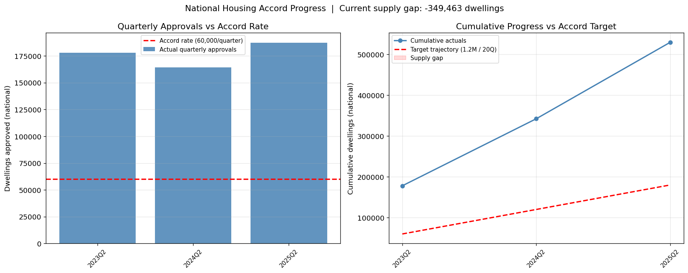
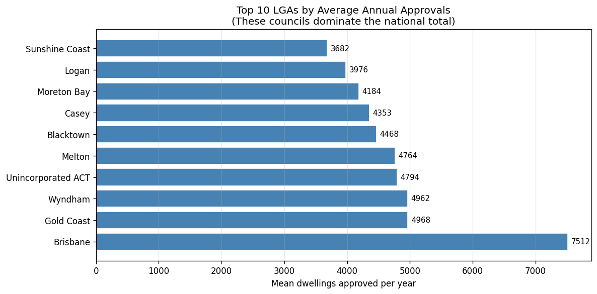
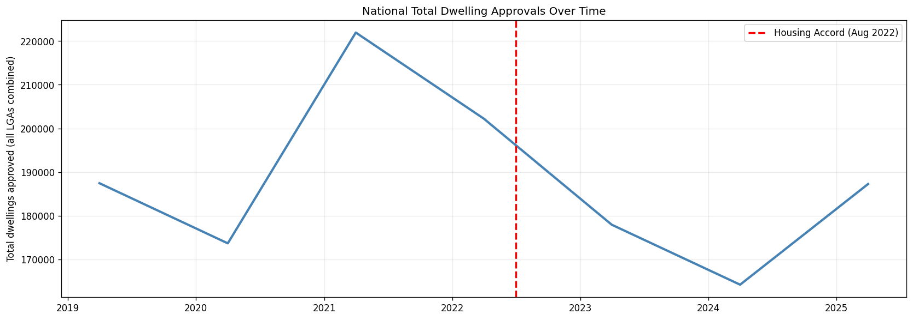
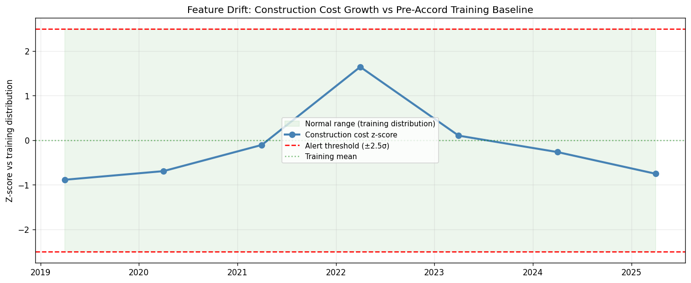
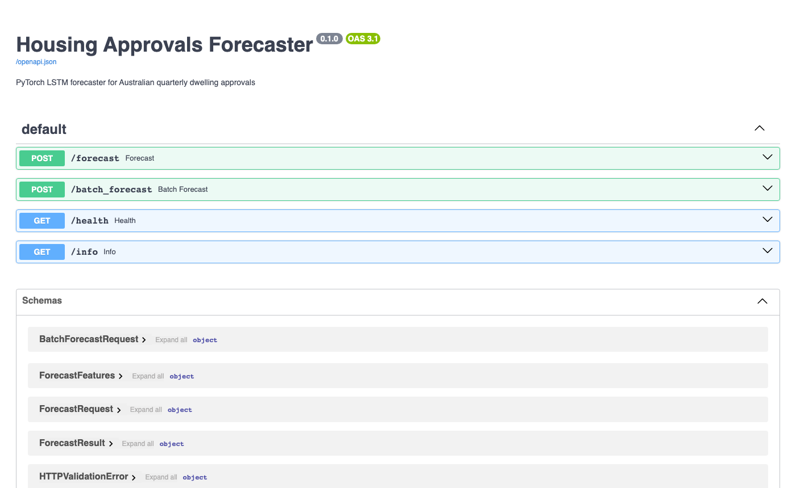

# Housing Approvals Forecaster


## The Problem

At PIA Congress 2026, Auckland planner John Duguid reported that the Auckland Unitary Plan lifted consented dwellings per capita from 5.9 to 9.3: a measurable supply response to planning reform. Australia's National Housing Accord targets 1.2 million new homes over five years. The question every planner, analyst, and infrastructure team is now asking: are Australian LGAs on track?

That is a forecasting problem. This project builds a production-grade answer: three competing models (Seasonal Mean, SARIMA, and a PyTorch LSTM) trained on ABS building approvals data, compared objectively via MLflow, with the champion served via FastAPI and monitored for drift. It demonstrates the full MLOps lifecycle that sits between a research model and a production deployment.

**Feature design is grounded in the supply-demand framework from housing research:** population growth (migration-driven demand), construction costs (delivery constraint), planning policy shifts, and autoregressive approval momentum. Monetary policy is absent by design: cash rate is not a model feature.

## What This Predicts

Quarterly dwelling approvals per Local Government Area (LGA), 4-quarter horizon.

- **Input:** 8 features per LGA: `approvals_lag1`, `population_growth_yoy` (ABS ERP), `construction_cost_yoy` (ABS PPI), seasonal dummies, `post_accord_2022`
- **Output:** Predicted dwelling approvals for the next 4 quarters
- **Granularity:** LGA-level (528 LGAs, 2019–2025)
- **Evaluation metrics:** MAE, MAPE, and a custom on-target hit rate (within 15% of actuals)

## Architecture



## Model Comparison

Results on held-out test set (post 2022Q2, post-Accord period):

| Model | MAE (dwellings) | MAPE | Hit Rate (±15%) |
|---|---|---|---|
| Seasonal Mean | **101.9** | **0.548** | **28.0%** |
| SARIMA(1,1,1)(0,1,1,4) | 163.0 | 0.834 | 21.2% |
| PyTorch LSTM (8 features) | 192.6 | 4.822 | 13.6% |

The seasonal mean baseline wins on all three metrics. See `notebooks/03_project_showcase.ipynb` for a full explanation of why: evaluation asymmetry, dominant lag signal, and cross-sectional LSTM training are the main factors.



### Forecast vs Actuals

Four sample LGAs at the 10th, 35th, 65th, and 90th percentile of average approval volume. Blue = training history, orange = test actuals, green = seasonal mean forecast.



## Key Findings

### National Housing Accord Progress

Australia has not consistently hit the 60,000 dwellings/quarter pace required by the Accord. The cumulative supply gap has widened each year since 2022Q3.



### Supply Concentration

Housing supply is heavily concentrated. The top 10 LGAs (mostly outer-suburban growth corridors) account for roughly 30% of all national approvals. Most of the 528 councils approve fewer than 200 dwellings per year.



This is the core design rationale for per-LGA forecasting: national models obscure which specific councils are underperforming their historical pace, and by how much.

### The Construction Cost Headwind

Post-COVID supply chain disruption pushed house construction costs to ~15–20% YoY growth in 2021–2022: the steepest increase in decades. This suppressed the supply response at exactly the moment demand was rising from migration. The national approvals trend makes this visible:



Construction cost pressure is both a model feature (`construction_cost_yoy`) and a drift monitoring signal. When it moves outside the training distribution, the monitoring layer raises an alert.

### Why the Simple Model Won

`approvals_lag1` has the highest correlation with the target by a wide margin: approval momentum is the dominant short-term signal. The seasonal mean implicitly captures this in two lines of code. The LSTM has 52,289 parameters and needs to find *additional* signal on a dataset of only ~3,400 rows, trained cross-sectionally with `seq_len=1` (no temporal sequences during training). Honest benchmarking means promoting the model that actually works.

## The 2022 Policy-Shift Drift Event

The National Housing Accord was announced in August 2022 (2022Q3). Around the same time, post-COVID construction cost inflation peaked, with house construction PPI growing at ~15–20% YoY: far outside the pre-2022 training distribution. Any model trained on pre-Accord data faces a structural break at this point.

This project's monitoring layer catches that in two ways:

1. **Feature drift** (immediate): construction cost YoY moves outside the training distribution. The z-score can breach the 2.5σ threshold in the same quarter as the cost shock, without needing ground truth.
2. **Residual drift** (lagged): rolling MAE exceeds 1.5× the training baseline. This typically triggers 1–2 quarters after the feature drift flag, once actual approvals data accumulates.



See `notebooks/02_drift_case_study.ipynb` for the full case study with annotated charts.

## API

The FastAPI server exposes interactive docs at `http://localhost:8000/docs`. All endpoints are typed with Pydantic; the `/forecast` endpoint accepts an LGA code and feature vector and returns a 4-quarter prediction.



## Quick Start

### With Docker Compose

```bash
cp .env.example .env
docker compose up
# MLflow UI: http://localhost:5000
# API:       http://localhost:8000
```

### Local Development

```bash
uv sync

# Download all data (ABS building approvals, population, PPI construction)
uv run python -m data.download

# Build feature set
uv run python -m data.pipeline

# Train baselines
uv run python -m training.train_baseline

# Train LSTM
uv run python -m training.train_lstm

# Compare and promote champion
uv run python -m training.compare

# Start API server
uv run uvicorn serving.app:app --reload --port 8000
```

### Run Tests

```bash
uv run pytest --cov=. --cov-report=term-missing
```

## API Usage

Forecast next 4 quarters for a single LGA:

```bash
curl -X POST http://localhost:8000/forecast \
  -H "Content-Type: application/json" \
  -d '{
    "lga_code": "24600",
    "features": {
      "approvals_lag1": 320,
      "population_growth_yoy": 0.015,
      "construction_cost_yoy": 0.05,
      "season_q1": 0,
      "season_q2": 1,
      "season_q3": 0,
      "season_q4": 0,
      "post_accord_2022": 1
    }
  }'
```

Health check:

```bash
curl http://localhost:8000/health
```

## Data Sources

| Source | Content | Granularity | Used for |
|---|---|---|---|
| ABS Regional LGA2020/2021 | Quarterly dwelling approvals (BUILDING_4) | LGA | Target variable + `approvals_lag1` |
| ABS Regional LGA2020/2021 | Estimated Resident Population (ERP_P_20) | LGA | `population_growth_yoy` |
| ABS PPI 6427.0 Table 17 | House construction output price index | National | `construction_cost_yoy` |

All sources are free, publicly available, and require no authentication. The ABS Regional CSVs are large (~300 MB each) but are downloaded once and reused for both approvals and population.

## Limitations and Next Steps

### Current limitations

**Data frequency.** ABS publishes LGA building approvals annually (by financial year). Each row is one LGA x financial year, mapped to Q2. There is no true quarterly granularity at the LGA level, which limits sequence modelling, the LSTM sees one observation per LGA per year, not per quarter.

**Dataset size.** 528 LGAs x 7 years = 3,371 rows. Deep learning models rarely outperform well-tuned statistical baselines at this scale. The LSTM's recurrence is wasted when trained with `seq_len=1`.

**Evaluation asymmetry.** The baselines were evaluated on a temporal hold-out (post-2022Q2, including the structural break). The LSTM used a cross-sectional 80/20 LGA split with no temporal hold-out. The metrics are not directly comparable; the LSTM may actually perform better or worse than the table implies under a fair comparison.

**Point forecasts only.** The model produces a single predicted value per LGA per quarter. Planning decisions benefit from uncertainty bounds; there is no conformal interval or prediction interval implemented.

**National cost signal.** `construction_cost_yoy` is the national ABS PPI index. Local cost variation (labour shortages in outer Sydney vs inner Melbourne, transport cost differences) is not captured.

**Supply does not imply affordability.** Approval forecasts are a leading indicator of new supply, not a predictor of prices. Auckland's decade of upzoning produced record approval volumes while median prices stayed near NZ$1M.

### What would improve the model

1. **True quarterly LGA data.** State-level quarterly approvals could bridge the gap, enabling `seq_len > 1` for the LSTM and proper temporal evaluation.
2. **Re-evaluate LSTM with temporal split.** Fix the evaluation asymmetry to get an honest apples-to-apples comparison before writing off the LSTM.
3. **Conformal prediction intervals.** Wrap the champion model with a split conformal predictor to produce calibrated uncertainty bounds per LGA.
4. **Per-LGA drift alerts.** Current drift detection is global. Individual councils can experience structural breaks (large rezoning, infrastructure announcement) that a national signal misses.
5. **Planning reform features.** Zoning amendment data and state planning policy changes would give the model access to the policy signal it currently only approximates via `post_accord_2022`.
6. **Completion-lag model.** Chain the approval forecast with an empirical approval-to-completion delay distribution (typically 12–24 months) to project actual dwelling additions to stock.

## Why This Exists

Deploying an ML model is not the same as training one. This project is the production engineering layer that comes after the research: experiment tracking to compare multiple models objectively, a model registry to manage versioning and promotion, a typed API to serve predictions at request time, a prediction log to accumulate ground truth, and a monitoring layer to detect when the model has stopped working.

The 2022 policy-shift event is a real, dateable structural break. The feature drift signal (construction cost z-score) can trigger in the same quarter as the break: before performance visibly degrades. That is the production value of monitoring: early warning, not post-mortem.
